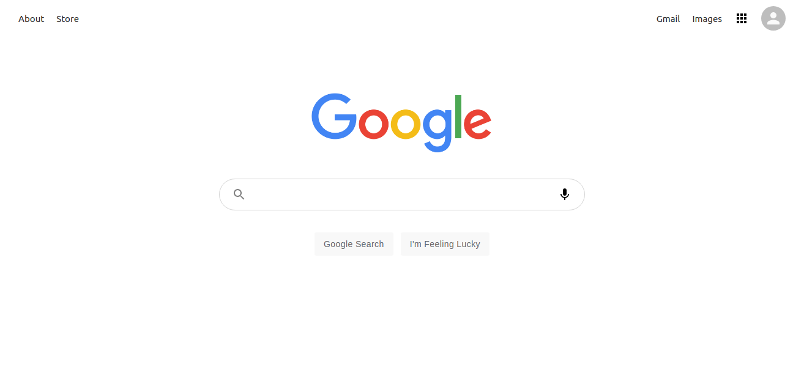

## Google Clone

Google Clone Using ReactJs

Fully Functional Google Clone Using React, React Context API, Material-Ui, HTML && CSS. Used Real time search Result appear on screen using Google custom Search API.

## Built With

- ReactJs
- React Context API
- React Router
- Google Custome Search API
- HTML
- CSS
- Material-Ui

## Live Demo

[Live Demo](https://clone-c88ef.web.app/)

## Getting Started

To get a local copy up and running in your local computer follow these simple steps.

### **Prerequisites**
you will need to install nodejs in you local machine in order to run this project.

- install nodeJs
- insatll yarn (We are going to use yarn to install some of the required dependency)

### **Setup**

To Setup some of the requirements follow the steps:

### **Install**
To install some of the require dependency in your local machine do the following steps:

- clone the repository
- in your terminal type `yarn install` if you have not installed yarn [click Here](https://classic.yarnpkg.com/en/docs/getting-started)

### **Deployment**
We are going to use Google Firebase to deploy out App (to know how to depoly website on firebase [clik here](https://firebase.google.com/docs/hosting))

## Author

:bust_in_silhouette: **Author**

- GitHub: [@Div685](https://github.com/Div685)
- Twitter: [@div_685](https://twitter.com/div_685)
- LinkedIn: [Divyesh Patel](https://www.linkedin.com/in/divyesh-daxa-patel/)

## :handshake: Contributing

Contributions, issues, and feature requests are welcome!

Feel free to check the [issues page](https://github.com/Div685/Google-Clone/issues).

## Show your support

Give a :star: if you like this project

## Acknowledgments

## License

This page is [MIT](https://github.com/Div685) licence
